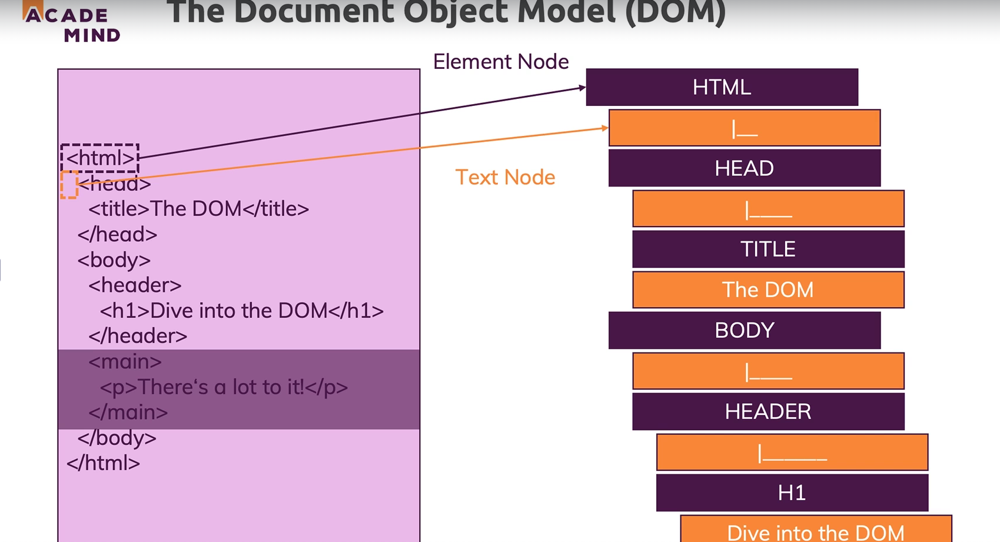
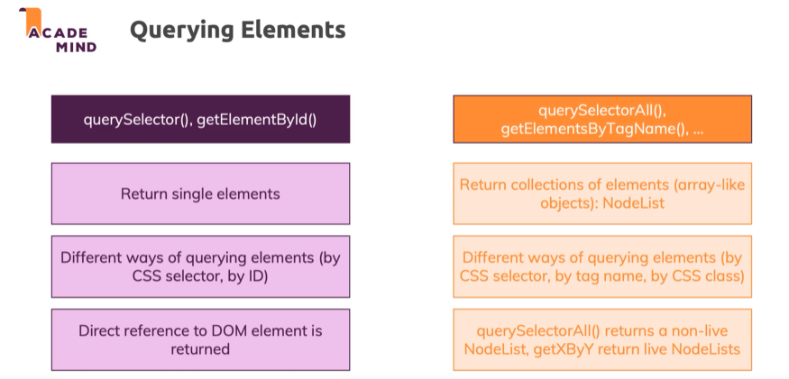
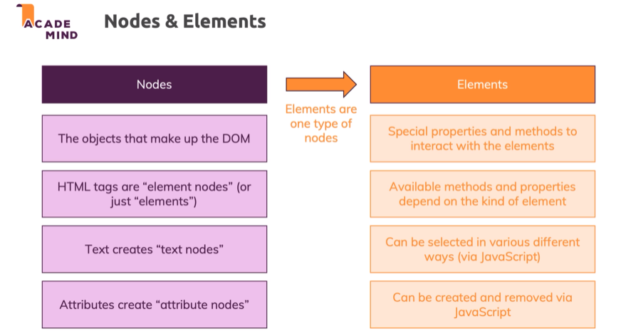
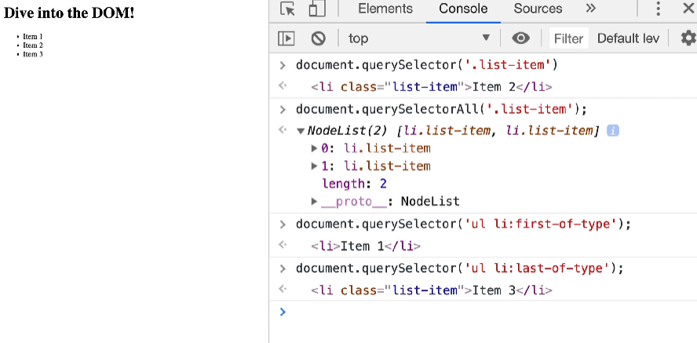
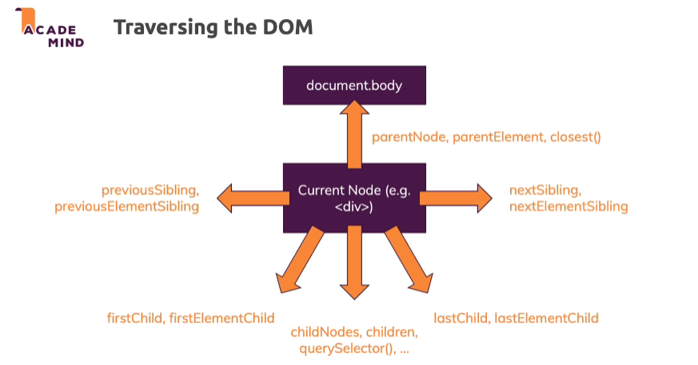

# Dom and html elements


The html tags are directly converted into nodes which become the part of the dom tree
The relation between the tags are conserved meaning, the html tag(or node) is the parent node of all elements
The space between tags are also stored as Text node, even though browsers don't render them
The text in-between tag is also stored as text node

## Nodes and elements

We have two ways to query elements or nodes
1. querySelector(), getElementsById()
2. querySelectorAll(), getElementsByTagName(),...

The difference between the two is the first return single element while the latter returns multiple

## Nodes vs Elements    


Elements are a type of node 
The node is what makes up the DOM
Elements are html tags and provides special functionality to interact with the elements
Elements can be created and removed and also selected in various ways using javascript


## Different ways to select elements

document.getElementById is an older method to search for elements by ID
Now we can use querySelector or querySelectorAll to can pass it the id or class
And it must to provided in an css way like id using # and class using '.'

## Manipulating elements
Now after the querying is done and we get the element
We can now store it and manipulate it using it's different properties it has
We can search for them using the console.dir() function

## Attributes vs Properties
Attributes are the key value pair that are passed to the element tags
```
<a src="" alt=""></a>
```
In the above code src and alt are attributes

When these elements are created in the dom they are assigned these properties automatically

**Often but not always, attributes are mapped to properties and live synchronisation is set up**

We have different types of mapping
1. 1:1 Mapping where name of attribute and property is same
    Eg. id, these are live synced
2. Different name but live synced: Where the names are different but they are synced
    Eg. class -> (variable).className
3. 1:1 mapping but not live synced

```
const h1 = document.findElementById('h1');
h1.id = "new-id";
```
If we do the thing showed in the code above, the id of the h1 element will be changed to new-id in the dom tree
But if we do something like this to value of an element
```
h1.value = "something";
```

This will not change the real value in the dom 

We can change it though if we want to using setAttribute() function
```
h1.setAttribute('value', 'something else');
```
This will change the value in the dom
But since live sync is off, the screen will still show the old data
But again, we can call the getAttribute method and this will force an update
```
h1.getAttribute('value');
```

> QuerySelector uses css selector to match elements

## Traversing the DOM

After selecting a dom element, we can select its child, descendant, parent or ancestor
The element node itself have property to traverse these elements


