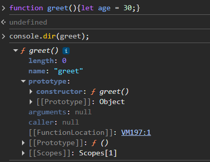

# Functions

Standalone block of code

## Function vs methods
**Methods are also functions but they are functions that are associated with an object or class and operates on its data.**
All methods are functions but not all functions are methods

### Laguage specific terms
* C: Only has function(no class)
* Java and C#: All subroutines must be part of a class, so only the term method is used
* Python and C++: Both are used, Functions are standalone, while methods are "member functions" within a class.
* JavaScript: Functions are first-class objects that can exist independently, but when a function is stored as a property of an object, it is called a method of that object. 

```
function meow(){
    console.log("meow");
}

const methodEg = {
    m1: function me2(){
        console.log("meow 2");
    }
}
```

> Here meow is a function and me2 is a method because it is stored as a property of an object

## Functions are also objects
To check this we can do this:
```
console.dir(funcName);  
```


This means they can also be stored in variables
```
const meow = function(){ // This is an anonymous function
    return "meow";
}
```

This gives rise to another way of declaring functions

```
// The normal way(function declaration)
function multiply(a,b){
    return a*b;
}

// The other way(function expression)
const multiply = function(a,b){
    return a*b;
}

```

The difference between these is that in the function declaration, the function is hoisted to the top and can be used even before it's declared
```
meow();

function meow(){
    console.log("meow");
}
```

> This works because JS hoists meow to the top

```
meow();

const meow = function () {
    console.log("meow");
}
```
> This will throw an exception even though in this case too, JS will hoist the **const** meow to the top and declare it
> But not define it     