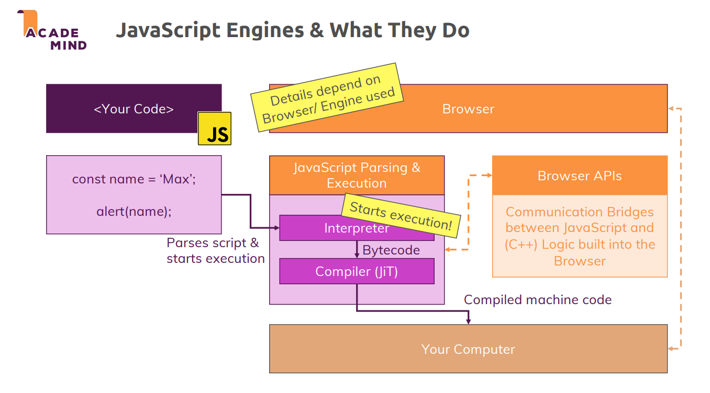
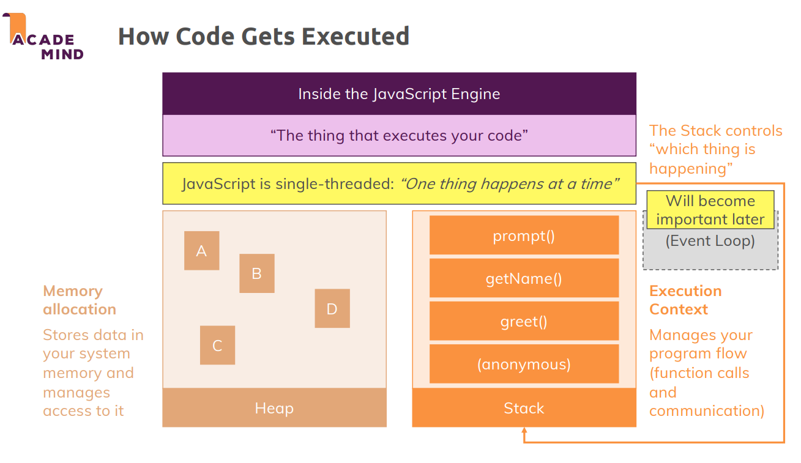
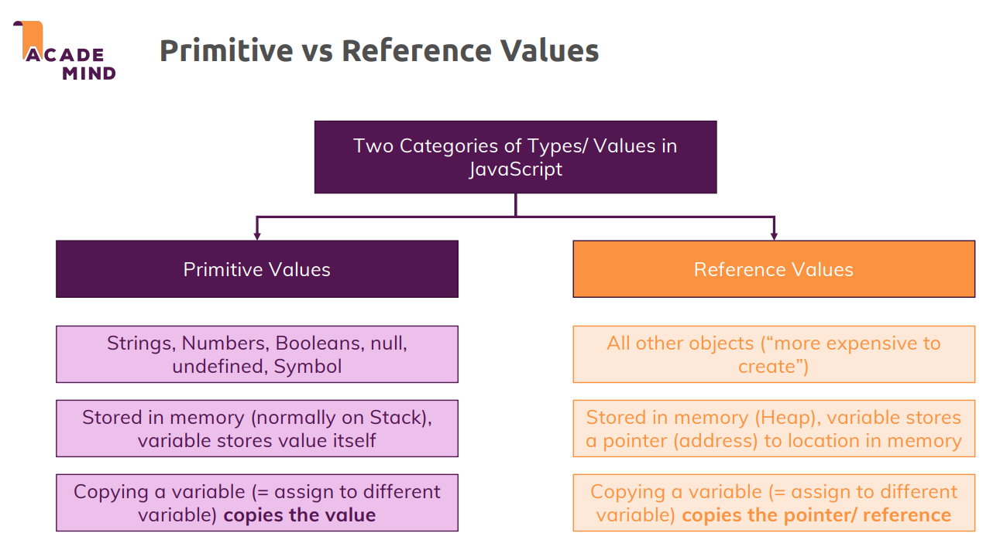

# EcmaScript 

It's the way everything in modern JS is modeled after
It's the specification that every JS engine needs to implement
That doesn't mean every engine does include every feature present in EcmaScript, they can choose what to and what not to keep


## EcmaScript 5
The first important version of Ecmascript was ES5
It was the progenitor of what is now called the modern javascript

Supported by every browser there is, including Internet explorer
**One important thing to note is that it only had var, no let and const**

## EcmaScript 6
The modern Javascript
Introduced in 2015 
Has many features that help us write better, cleaner and faster code.
Can be transpiled into ES5
Still under development 

## var vs let vs const

| var | let | const |
|-----|-----|-------|
|Creates a variable|Creates a variable|Creates a variable|
|Available since beginning|since ES6|since ES6|
|Function and global scope|Block Scope|Block Scope|


### let


```
let name = "Max";
let name = "Meow"; // This too will throw an error

function greet(){
    let age = 30;
    console.log(name, age);
    // This will print name and age: Max, 30
}

console.log(name, age);
// name will be printed but age will throw a
> Uncaught ReferenceError: age is not defined

```

### const
```
const name = "Max";
const name = "Meow"; // This too will throw an error

function greet(){
    const age = 30;
    console.log(name, age);
    // This will print name and age: Max, 30
}

console.log(name, age);
// name will be printed but age will throw a
> Uncaught ReferenceError: age is not defined

```

### var

```
var name = "Max";
var name = "Meow"; 
> This will not throw an error, instead change name to Meow

function greet(){
    var age = 30;
    console.log(name, age);
    // This will print name and age: Max, 30
}

console.log(name, age);
// This too will print name and age: Max, 30
// Even though age is defined in block scope
```
## Hoisting
The JS engine before running the code line by line, goes through the entire code and store the functions so that they can be available when needed
It does a similar thing with variable declaration too, what the engine does is basically move the declaration to the top of the code

Earlier, in es5, when hoisting was done, when a variable was declared using var, it defined the variable to **undefined**
But now, in es6, it does not do that and that results in an exception

```
console.log(a);
var a;
```
> logs undefined
```
console.log(a);
let/const a;
```
> logs exception

## Strict Mode
JS is a very forgiving language and will let you do about anything that should be restricted
Like letting you declare
```
username = "meow";
```
and when you'll print this, it will, behind the scenes add a var to it automatically
Or it can also let you use reserved keywords like undefined for declaring variables
```
let undefined = "moew";
```
This will work
To restrict this, we at the top add 'use strict';
and now the above codes will throw exceptions

## Javascipt script engine(Parsing and compilation)



The flow is pretty similar to how, java does it
Our code is first interpreted by the JS engine, in case of chrome it's v8.
It gets converted to byte code, line by line by the interpreter.
Then compiled by the JIT(just in time compiler, called turbo fan in chrome) to machine code
This machine code is handed to the OS for faster execution

> Both interpretation and compilation happens side by side, as soon as the interpreter is done, JIT comes in

The engine, also adds some optimizations like, if the code is not changed, there is no need to do the whole interpreting + compiling process all again
Instead it uses the already stored code

The engine, also adds some additional features, called the browser api, that let us communicate with the browser code
These let us do things like getting the user's location, etc. 
The api is loaded with the machine code, so the functions are known by the code

## Code Exucution



### Heap
This is where our long term data is stored, that will be used throughout the execution of our program
This is done by browser in conjucture with the os
Memory management is done here

### Stack
This is basically the call stack which stores the info about which function will be executed first
> **The function that is called in here is always called anonymous, which is basically the script**
After each function is done being executed, this anonymous function is also popped off
*But what about the asynchronous functions or event listeners?*

They wait for a certain thing to happen before they get executed
So how will they be executed if the stack is clear?
**They are managed by the Event Loop**

> One important thing to note is that javascript is single threaded, so only one thing happens at a time
By event loop, for now we can say that they are managed by the browser instead of the javascipt engine.
So they work even after code is done executing

## Primitive vs Reference Type



Primitive type when assigned to another variable, get copied only by their value and not address
So if we change the original variable, it won't affect the new variable at all

Reference types on the other hand are different
They store the memory of the variable and not the value itself
This is done because reference types are heavy to store and it's faster to store the address than the whole object

```
int a = 3;
int b = a;

a++;
console.log(b);
// > 3
```
> The value of b doesn't change even though the value of a was

```
int a = [1,2];
int b = a;

a.push(3);

console.log(b);
// > [1,2,3]
```
> Even though 3 was added to array a, when b was printed with 1,2,3
This is because, array is a reference type and when we assign a variable to an array, we store the address of the array and not the contents of the array

One more confusing thing is we can do this:

```
const a = [1,2];
a.push(3);

console.log(a);
// this will print [1,2,3]
```
> This shouldn't be working because a const can't be changed

The reason this works is because, we are storing the address of the array in a
The address can't change but the contents of it can

```
const a = [1,2];
const b = [1,2];

console.log(a === b);
// this will print false
```

> The address of a and b are different

