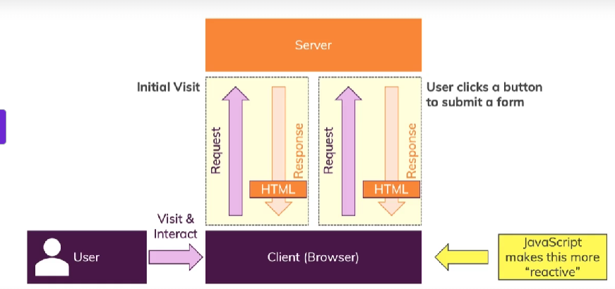

# What is Javascript
It's a dynamic, weakly typed programming language which is compliled at runtime. It can be executed as a part of a webpage in a browser or directly on any machine("host environment").

Also to make webpages more dynamic

## How do webpages work?
Through request and response, from client to server and back

## How is javascipt executed?
Our source code is passed to the built in engine in the browser that converts our source code to machine code which is faster.
The machine code is then exxecuted and the output is displayed on the browser.
All this happens on a single thread.

### Javascript engines
* V8 (Chrome)
* SpiderMonkey (Firefox)

## What does dynamic and weakly typed means?
> JS is a dynamic, interpreted programming language and also a weakly typed programming language

### Dynamic and interpreted 
* Not pre compiled, but parsed and compiled on the fly
* Code evaluated and executed at runtime
* Code can change at runtime (eg. type of a variable)

### Weakly typed
* Data assumed automatically
* We don't define that some variable has to hold a certain value
* Data types are not set in stone and can change

# What does it mean when we say JavaScript runs on a host environment

## Browser-Side
* JavaScript was invented to create dynamic websites by executing in the browser
* Can manipulate htlm, css, send/receive http requests, etc.
* Can't access local file system, interact with os

## Other
* Node.js was created to run js anywhere
* used to build web pages
* can access local file system, and interact with the os
* Can't manipulate html and css

# Java vs JavaScript
| Java | JavaScript | 
|:---- |:---------- |
| Strongly typed oop lang | Weakly type, flexible |
|can't run in browser | can run in browser|

# ECMA (European Computer Manufacturers Associaion)
JS submitted to ecma for standardizing the language

## ECMAScript
JavaScript is actually ecmascript which is developed by the ecma org and each browser vendor implements it in their own JS Engine 

Each browser comes with its own JS Engine and defines which features are actually supported

